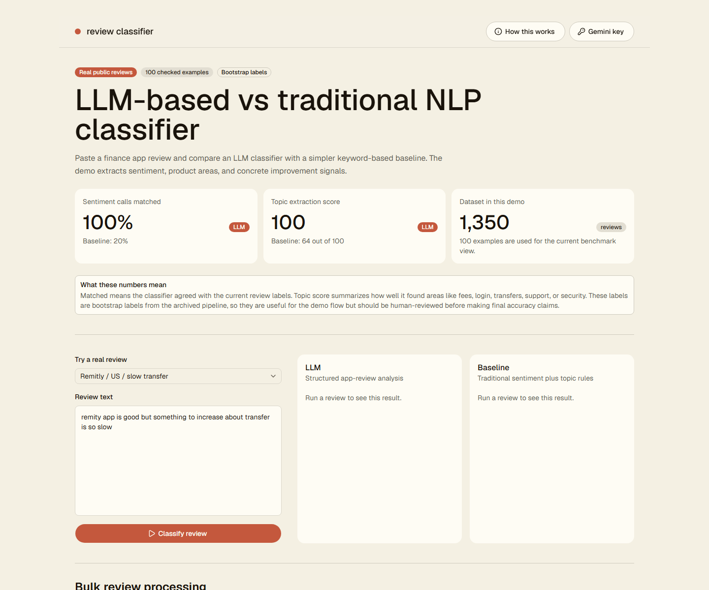

# LLM Classifier: App Review Sentiment + Topic Analysis

This project analyses public mobile app reviews and compares two approaches:

- an **LLM classifier**, which reads the review and returns structured analysis
- a **traditional NLP baseline**, which uses sentiment modelling plus keyword/topic rules

The goal is simple: show how customer reviews can be turned into useful product signals such as sentiment, problem areas, and requested improvements.

[GitHub repo](https://github.com/tamas-j/gemini-classifier) · [Live demo](https://review-classifier-ten.vercel.app/)



## What The App Does

For each app review, the classifier returns:

- **Sentiment**: very negative, negative, neutral, positive, or very positive
- **Product areas**: fees, login, transfers, support, security, UI, performance, and related topics
- **Improvement signals**: short phrases describing what the user wants fixed or improved
- **Language, confidence, and rationale**

The web app lets you try this on one review or a small batch. The Python pipeline handles repeatable batch processing and benchmarking.

## Why Compare LLM vs Traditional NLP?

Traditional NLP can be fast and cheap, but it often struggles with messy reviews, mixed sentiment, multilingual phrasing, and topic extraction. LLMs are slower and need an API key, but they can follow a richer rubric and return structured reasoning.

This repo keeps both approaches visible so the tradeoff is easy to inspect rather than hidden behind one model output.

## Current Benchmark

Run:

```bash
python prompt_contract.py
python benchmark.py --skip-llm --skip-baseline --lexicon-only
```

Current bootstrap benchmark:

| Pipeline | n | Sentiment accuracy | Macro F1 | Aspect precision | Aspect recall | Aspect F1 |
|---|---:|---:|---:|---:|---:|---:|
| Cached LLM/rubric output | 100 | 1.000 | 1.000 | 1.000 | 1.000 | 1.000 |
| XLM-R sentiment + aspect lexicon | 100 | 0.200 | 0.163 | 0.645 | 0.629 | 0.637 |

Plain-English version:

- **Sentiment accuracy**: how often the classifier picked the same sentiment label as the benchmark label.
- **Macro F1**: a balanced score across sentiment classes, so rare labels still matter.
- **Aspect precision/recall/F1**: how well the classifier found the right product areas, such as fees or support.

Important caveat: the current benchmark labels are **bootstrap labels** from an earlier review pipeline, not a completed human-labelled holdout. The LLM cache currently mirrors those labels so the benchmark can run without an API key. Treat the benchmark as a working evaluation harness, not a final accuracy claim.

## Dataset

The committed dataset contains **1,350 public Google Play and iTunes reviews** for:

- Wise
- Remitly
- WorldRemit
- Xoom
- Revolut

Dataset summary:

- Date range: 2024-05-14 to 2026-04-21
- Platforms: 1,000 Android reviews, 350 iOS reviews
- Countries: 1,100 US, 150 DE, 50 GB, 50 FR
- Benchmark subset: 100 bootstrap-labelled rows

The dataset is public app-store review data. It is not client data.

## Quickstart

Install Python dependencies:

```bash
uv sync
```

Run the prompt/schema check, baseline, and benchmark:

```bash
uv run python prompt_contract.py
uv run python baseline.py --manifest input/sample_reviews.jsonl --lexicon-only
uv run python benchmark.py --skip-llm --skip-baseline --lexicon-only
```

Run live LLM classification:

```bash
copy .env.example .env
uv run python classify.py --manifest input/sample_reviews.jsonl --prompt prompts/app_reviews.md
```

Set `GEMINI_API_KEY` or `GOOGLE_API_KEY` in `.env`.

The original generic classifier flow is still available:

```bash
uv run python classify.py --manifest input/manifest.jsonl --prompt prompts/system.md
```

## Web App

```bash
cd web
pnpm install
pnpm dev
```

Open `http://127.0.0.1:3000`.

The web app supports:

- preset real reviews
- custom single-review classification
- small-batch LLM processing, capped at 10 reviews
- optional Gemini key entry in the UI
- cached baseline comparison for preset examples

For deployment, set `GEMINI_API_KEY` as a server-side Vercel environment variable. Do not commit `.env.local`.

## What Runs Where

| Capability | Python CLI | Web app |
|---|---|---|
| LLM classification | Live with `GEMINI_API_KEY` | Live with env key or user-provided key |
| Traditional baseline | Real Python processing via `baseline.py` | Cached preset outputs only |
| Bulk processing | JSONL-scale batch jobs | LLM-only small batches, max 10 reviews |
| Benchmark report | Real metric computation | Static headline numbers from `web/lib/benchmark-report.ts` |

## Project Structure

| Path | Role |
|---|---|
| `classify.py` | Resume-safe Gemini JSONL classifier. |
| `schema.py` | Pydantic v2 structured-output schema. |
| `prompts/app_reviews.md` | App-review classification prompt. |
| `prompts/system.md` | Original generic starter prompt. |
| `baseline.py` | Traditional NLP baseline with XLM-R support and lexicon fallback. |
| `benchmark.py` | Sentiment and aspect benchmark harness. |
| `prompt_contract.py` | Prompt/schema hygiene checks. |
| `input/sample_reviews.jsonl` | Public review sample. |
| `input/sample_reviews_labels.jsonl` | Bootstrap benchmark labels. |
| `input/sample_reviews_gemini_cache.jsonl` | Cached LLM-shaped benchmark output. |
| `web/` | Next.js App Router demo. |

## Replacing The Bootstrap Benchmark

To turn the benchmark into a stronger accuracy claim:

1. Create a human-reviewed holdout with `id`, `primary_label`, `aspects`, and `language`.
2. Run Gemini Flash over exactly that holdout.
3. Run the baseline over the same rows.
4. Run `benchmark.py`.
5. Update the README table and `web/lib/benchmark-report.ts`.

## Using Your Own Reviews

Create a JSONL file:

```json
{"id": "row-1", "text": "The app is slow after login.", "lang": "en"}
```

Run:

```bash
uv run python classify.py --manifest input/your_reviews.jsonl --prompt prompts/app_reviews.md --output output/your_gemini.jsonl
uv run python baseline.py --manifest input/your_reviews.jsonl --output output/your_baseline.jsonl
```

For benchmarking, provide labels with `id`, `primary_label`, `aspects`, and `language`.

## Privacy And Safety

- No client data is included.
- No API keys are committed.
- `output/`, `.env`, `.env.local`, and Python cache files are ignored.
- The web demo rate-limits classify requests to reduce accidental API spend.

## Acknowledgments

The batch LLM classification loop is inspired by Andrej Karpathy's public jobs-classification project: [github.com/karpathy/jobs](https://github.com/karpathy/jobs). This repo adapts that structured-output pattern to app-review sentiment and topic analysis.
